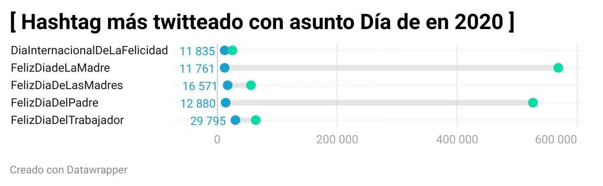

## PRÁCTICA 4 DATOS: TU HISTORIA DE PERIODISMO DE DATOS

NOTICIA O HISTORIA DEL GRÁFICO

# EL DÍA DE LA MADRE COMO DÍA MÁS TWITTEADO EN 2020

Entre los días más twitteamos del año sin duda, el día de la madre es el que ocupa el primer puesto en el podio con el que se han publicado cerca de 600.000 tweets, junto con otro de los tweets más sonados del año, #FelizDiaDeLasMadres, que a pesar de ser otro hashtag diferente, aborda el mismo tema. Le sigue #FelizDiaDelPadre, con una cifra muy parecida, pero inferior a la del Trending Topic por excelencia del año pasado. Pero, es curioso ver los temas de los dos hashtags restantes, como son #DíaInternacionalDeLaFelicidad y el #FelizDíaDelTrabajador, este último siendo el tercero más twitteado, también puede ser que al ser día festivo, la población tenga más tiempo para mirar el móvil y tener más interacciones a través de la red.  

Se ha decidido escoger los “Días De” más twitteados del 2020 porque es un dato que se puede recopilar de manera clara y concisa, donde se ve cual es el día que tenga algún motivo para celebrar que más twittean los españoles. También se ha reducido solo al año 2020 porque es el año más actual que se tiene en el conjunto de datos, además de por haber ya cerrado el ciclo anual, ya que si hubiésemos cogido los “Día de” 2021 no podríamos hacer un análisis concluyente, ya que todavía quedaría el mes de diciembre. 

Además, comentar que se ha decidido escoger un tipo de gráfica de puntos a través de la aplicación de Datawrapper debido a que es mucho más aclaratoria a la hora de leer los gráficos. Se ven dos colores diferenciados, el primero que es de color azul, el cual marca el inicio del recorrido de la cantidad de tweets que ha tenido ese Hashtag a lo largo del día, y un punto de color verde, que es el que determina el recorrido final que ha tenido ese Hashtag, el cual coincide con el eje de abscisas, donde aparece las cifras de cien mil a cien mil. 

# MEMORIA DEL PROCESO DE REALIZACIÓN DEL GRÁFICO

Comenzamos cogiendo el archivo de datos facilitado por el profesor de la asignatura acerca del recuento de hashtags que han sido tendencia desde principios de 2020 hasta 2021, que se encuentra en la carpeta de periodismo de datos en GitHub, el archivo tiene como nombre Feliz.csv.  Abrimos el programa de OpenRefine, con el objetivo de ordenar esta serie de datos en una serie de clasificaciones con las que luego crearemos nuestro gráfico. Para ello se ha decidido acotar el número de datos en buscar todos aquellos hashtags que contengan “Día de”.
Primeros hemos acotado las fechas solo al año 2020 mediante un “timeline facet” eligiendo las fechas desde el uno de enero de 2020 hasta el 31 de diciembre de ese año

2. En todas las columnas que tenemos; 1º fecha, 2º Hashtags, 3º links a twitter de los hashtags, 4º columna con el total de tweets escritos sobre esos hashtags. En la columna de los hashtags hemos hecho un “text facet” para  poder ver los hashtags con el asunto “Día de” de 2020. 
Función marcada: (Text transform on 39 cells in column Column 1: value.toDate()) 

3. Una vez vistos los hashtags “Día de” hemos seleccionado la función “Edit include” en el resto de hashtags con motivos diferentes para eliminarlos “Remove select” y solo quedarnos con los que nos interesan para este análisis.

4. (Blank down 31 cells in column Column 2) realizamos esta función para comenzar on el proceso de eliminación de repetición de hashtags y que solo nos queden, en este caso, los cinco hashtags seleccionados con el motivo “Día De”, aunque nos salen todavía las distintas casillas de número de tweets que debemos sumar para ver el recuento de los mismos en cada hashtag.

5. Debido a que ya tenemos los hashtags seleccionados solo en el año 2020, decidimos quitar la columna de fechas, debido a que es untado que no necesitamos que se especifique día por día en el gráfico a realizar. Por lo que “Reordenamos columnas”

6. Para poder sumar todas las casillas de cada hashtag para hacer el sumario o subtotal de tweets escritos para cada hashtag utilizamos la función Create new column prueba based on column Column 4 by filling 36 rows with grel:row.record.cells['Column 4’].value.sum() que la ponemos seleccionando en “Edit column” y pinchando en la opción “And columna based on this column”, ponemos la función e inmediatamente se va a crear el sumario o cada uno de los subtitules d los cinco hashtags. 

7. Para finalizar la limpieza de datos con OpenRefine y que quede visualmente más claro, quitamos los símbolos de hashtags (#) con la función Text transform on 4 cells in column Column 2: grel:value.replace(‘#','')

8. Una vez que tenemos la tabla de datos, la exportamos en formato CSV y se guardará en nuestro ordenador

9. Abrimos la aplicación de DataWrapper donde daremos a crear proyecto, insertaremos nuestros datos ordenados en OpenRefine enfermado CSV en la casilla de “Upload Data”, donde una vez procesados pasaremos al segundo paso:

10. El segundo paso consiste en “Check and describe”, el cual nos avisa en caso de que haya algún dato erróneo o alguna celda en el lugar incorrecto, le volveremos a dar a procesar.

11. El paso tres consiste en la “visualización” de la tabla para crear un gráfico con los datos aportados, elegimos el mas adecuado a nuestros datos: en este caso yo he optado por el gráfico de puntos, ya que se puede establecer el recorrido del número de tweets en cada uno de los hashtags. 

12. Lo procesaremos y el 4º y último paso en la aplicación será exportar la imagen en formato PNG para poder guardarla y subirla a la carpeta de fotos que tenemos en GitHub, antes guardándola desde la terminal. 

13. Desde la terminal abrimos en nuestra carpeta: “Periodismo-de-datos-marta” el nano para poder escribir el proceso de creación del gráfico, lo guardamos y lo subiremos a la aplicación de GitHub mediante la serie de comandos utilizados como hicimos en las anteriores prácticas. 

